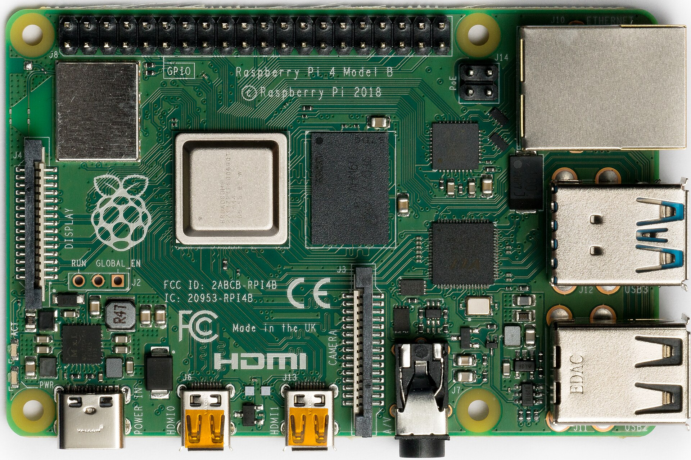

import Tabs from "@theme/Tabs";
import TabItem from "@theme/TabItem";

# Raspberry Pi Setup

During this course, we will be using a Raspberry Pi 4B as our main computer.
This section will walk you through the steps to get your Raspberry Pi up and running.

The Raspberry Pi is a small, single-board computer that can be used for a variety of projects.
It is a great tool for learning about computers and programming, and it is also a great tool for building projects.



## What you will need

- Raspberry Pi 4 (provided by the course)
- a microSD card (provided by the course)
- a USB-C cable (provided by the course)
- a computer with a USB port.

## Setting up the Raspberry Pi

The RPi has a microSD card slot on the bottom.
Insert the microSD card into the slot, and connect the RPi to your computer using the USB-C cable.
The RPi will power on automatically.

:::tip
If you are using a Windows computer, you may need to install a driver for the RPi.
You can download the driver [here](https://modclouddownloadprod.blob.core.windows.net/shared/mod-duo-rndis.zip).

1. Download and extract the zip file.
2. Open `Device Manager` on your computer and locate `COM & LPT ports`.
3. Connect the RPi to your computer and locate the new device (it should be called `COM PORT ...`).
4. Right-click on the device and select `Update Driver Software`.
5. Browse to the folder where you extracted the zip file.
6. Install the driver.

Check that the driver was installed by opening a terminal and running the following command:

```bash
ping backseat.local
```

:::

## Connecting to the Raspberry Pi

Once the RPi is powered on, you can connect to it using [SSH](https://en.wikipedia.org/wiki/Secure_Shell).
We will be using Visual Studio Code to connect to the RPi.

1. Open Visual Studio Code.
2. Install the [Remote - SSH](https://marketplace.visualstudio.com/items?itemName=ms-vscode-remote.remote-ssh) extension.
3. Click on the `Remote Explorer` icon in the left sidebar.
4. Select on the `Remotes (Tunnels/SSH)` from the dropdown.
5. Click on the `+` icon next to `SSH`.
6. Enter the following command in the input field:

```bash
ssh blue@backseat.local
```

The default password is `iamblue`.

:::note

You might be prompted to select a `config` file.
If so, select `~/.ssh/config` or `C:\Users\<username>\.ssh\config`.

:::

:::note

If you are asked to accept the host key, type `yes` and press `Enter`.

:::

:::note

If you are asked the operating system of the remote host, select `Linux`.

:::

Once connected, you should see a terminal window in Visual Studio Code (bottom).
You can now run commands on the RPi.

For example, you can now run the following command to check the IP address of the RPi:

```bash
hostname -I
```

## Creating a new user

The default user on the RPi is `blue`.
We will be using a new user for you for this course.

1. Run the following command to create a new user:

```bash
sudo adduser <username>
```

2. Enter a password for the new user.
3. Enter the password again to confirm.
4. Enter a full name for the new user.
5. Press `Enter` to skip the rest of the prompts.

## Setting up the new user

1. Run the following command to add the new user to the `sudo` group:

```bash
sudo usermod -aG sudo <username>
```

2. Run the following command to switch to the new user:

```bash
su <username>
```

3. Run the following command to create a new SSH key:

```bash
ssh-keygen -t ed25519 -C "<username>@backseat.local"
```

4. Press `Enter` to save the key in the default location.
5. Press `Enter` to skip the passphrase prompt.

## Connecting to the Raspberry Pi using the new user

Similar to the previous section, you can now connect to the RPi using the new user.

1. Click on the `Remote Explorer` icon in the left sidebar.
2. Click on the `SSH Targets` icon at the top of the sidebar.
3. Click on the `+` icon at the top of the sidebar.
4. Enter the following command in the input field:

```bash
ssh <username>@backseat.local
```

5. Enter the password for the new user.

You are now connected to the RPi using the new user you just created.

## Setting up the RPi for the course

For this course, we will be using a few tools that are not installed by default on the RPi.
We will now install these tools.

### ZSH

`zsh` is a Unix shell that can be used as an interactive login shell and as a
command interpreter for shell scripting. Zsh is an extended Bourne shell with a
large number of improvements, including some features of Bash, ksh, and tcsh.

We will be using `zsh` as our default shell in this course.

#### Install

```bash
sudo apt install zsh
```

#### Set as default shell

Set `zsh` as default shell:

```bash
chsh -s $(which zsh)
```

#### Restart shell

Restart the shell:

```bash
exec zsh
```

#### Oh-My-Zsh

[Oh-My-Zsh](https://ohmyz.sh/) is an open source, community-driven framework
for managing your zsh configuration (and it comes with a bunch of plugins and
themes).

##### Install

```bash
sh -c "$(curl -fsSL https://raw.githubusercontent.com/ohmyzsh/ohmyzsh/master/tools/install.sh)"
```

#### `.zshrc`

The `.zshrc` file is a script that is executed each time a new `zsh` shell is
started. It is located in your home directory (`~/.zshrc`).

You can edit the `.zshrc` file with your favorite text editor.

We will be adding some configuration to the `.zshrc` file in the next sections.

## Assigning the RPi a Static IP

By default, the interface between your Raspberry Pi and local machine will have dynamic IP addresses.
To simplify future sections of the course, you'll assign a static IP address to the Raspberry Pi.

### Raspberry Pi

Once connected to your Raspberry Pi, open the `/etc/netplan/50-cloud-init.yaml` file using the in-terminal text editor.
This file is responsible for defining network connections like the `usb0` interface to your local machine and the `wlan0` wifi interface.

```zsh
sudo nano /etc/netplan/50-cloud-init.yaml
```

After the file is open, modify the `usb0` interface to look like this:

```yaml
        usb0:
            dhcp4: false
            dhcp6: false
            addresses:
            - 192.168.3.2/24
            match:
                name: usb0
            set-name: usb0
```

:::info

Once the `usb0` interface matches the above code, press **`CTRL + X`** to close the file.
When you are prompted if you want to save the modified buffer, enter **`y`**.
Then, press **`enter`** an additional time to save the file using its current path and name.

:::

Apply the changes to the netplan in the same terminal:

```zsh
sudo netplan apply
```

### Local Machine

Now, you must also update the interface on your local machine.

:::warning

If you are using **Windows and WSL**, then for this section only, follow the Windows tab rather than the Ubuntu tab.

:::

<Tabs groupId="operating-systems">
<TabItem value="macos" label="macOS">

Open `System Settings > Network`.

Select the network interface for the Raspberry Pi (likely called `RNDIS/Ethernet Gadget`).

:::info

If you are unsure which interface this is, disconnect the RPi from your laptop.
This will remove the interface from the list.
Reconnect the RPi to your laptop and the interface should appear again.

:::

With the correct interface selected, click **`Details...`**.

Under the **`TCP/IP`** tab, set the **`Configure IPv4`** dropdown to **`Manually`**.

Enter the following
- **`IPv4 Address`** : `192.168.3.1`
- **`Subnet Mask`**: `255.255.255.0`

Click `OK` to save the settings.

</TabItem>
<TabItem value="windows" label="Windows">

Open **`Network Connections`**. Find the network interface for the Raspberry Pi.

:::info

This interface should appear as **`USB Ethernet/RNDIS Gadget`**.

If you are unsure which interface this is, disconnect the RPi from your laptop.
This will remove the interface from the list. Reconnect the RPi to your laptop and the interface should appear again.

:::

Right click on the interface and choose **`Properties`**.

Select **`Internal Protocol Version 4 (TCP/IPv4)`** and click **`Properties`**.

Choose **`Use the following IP address`** and enter the following:


- **`IPv4 Address`** : `192.168.3.1`
- **`Subnet Mask`**: `255.255.255.0`

Click `OK`, then close to apply the settings.

</TabItem>
<TabItem value="ubuntu" label="Ubuntu">

Open **`Settings`** -> **`Network`**.

Select the interface connected to your Raspberry Pi.

:::info

If you are unsure which interface this is, disconnect the RPi from your laptop.
This will remove the interface from the list. Reconnect the RPi to your laptop and the interface should appear again.

:::

Click the settings gear icon next to the itnerface.

Go to the **`IPv4 tab`** and set the **`IPv4 Method`** to **`Manual`**.

Click **`Add`** and enter:


- **`IPv4 Address`** : `192.168.3.1`
- **`Subnet Mask`**: `255.255.255.0`

Click `Apply` and reconnect the interface if needed.

</TabItem>
</Tabs>

#### Testing

Once these steps are complete, you should be able to run `ping 192.168.3.1` from a terminal on the `Raspberry Pi`.

:::warning

When you are done using your Raspberry Pi, run `sudo poweroff` and wait for it to complete before unplugging your RPi. If you skip this step, you may end up corrupting your Pi.

:::
