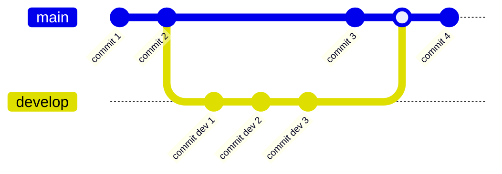

# 1.2 Git

[Git](https://git-scm.com/) is a distributed version control system that is widely used in software development to manage changes to source code and collaborate with other developers.
It allows multiple developers to work on the same project simultaneously, track changes made to the codebase, and merge changes made by different developers.
In this module, we will introduce the basic concepts of Git and how to use it effectively in your projects.

## Version Control

Version control is a system that records changes to a file or set of files over time so that you can recall specific versions later.
It allows you to revert files back to a previous state, compare changes over time, and see who last modified something that might be causing a problem.

## Distributed Version Control

Distributed version control systems (DVCS) like Git allow each developer to have a local copy of the entire repository.
This means that you can work offline, commit changes to your local repository, and then push those changes to a remote repository when you are ready to share them with others.
It also allows you to pull changes from the remote repository to keep your local copy up to date.

## Basic Concepts



### Repository

A repository is a collection of files and directories that are being tracked by Git.
It contains the entire history of the project, including all the changes that have been made to the files over time.

### Commit

A commit is a snapshot of the repository at a specific point in time.
It records the changes that have been made to the files since the last commit and includes a message that describes the changes.


### Branch

A branch is a parallel version of the repository that allows you to work on new features or bug fixes without affecting the main codebase.
You can create a new branch, make changes to the files, and then merge those changes back into the main branch when you are ready.

### Merge

Merging is the process of combining the changes from one branch into another.
When you merge a branch, Git will automatically resolve any conflicts that arise between the changes made in the two branches.

### Pull Request

A pull request is a request to merge changes from one branch into another.
It allows other developers to review the changes, provide feedback, and approve the merge before it is merged into the main branch.

## Getting Started

You already have Git installed on your Raspberry Pi, so you can start using it right away.
To get started, you need to configure Git with your name and email address:

```bash
git config --global user.name "Your Name"
git config --global user.email "XXXX@YYY.ZZZ"
```

You can check your Git configuration by running:

```bash
git config user.name
git config user.email
```

Now you are ready to create a new repository, commit changes, create branches, and collaborate with other developers using Git.

## Simple Workflow

Here is a simple workflow that you can follow when working with Git:

1. Create a new repository:

```bash
git init
```

2. Add files to the repository:

```bash
git add .
```

3. Commit changes to the repository:

```bash
git commit -m "Initial commit"
```

4. Create a new branch:

```bash
git checkout -b new-feature
```

5. Make changes to the files and commit them:

```bash
git add .
git commit -m "Add new feature"
```

6. Merge the changes back into the main branch:

```bash
git checkout main
git merge new-feature
```

7. Push the changes to the remote repository:

```bash
git push origin main
```


