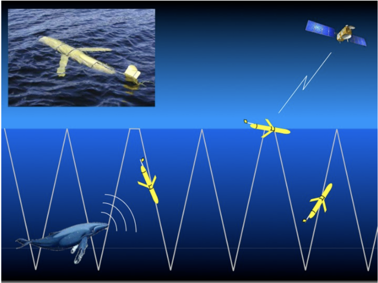
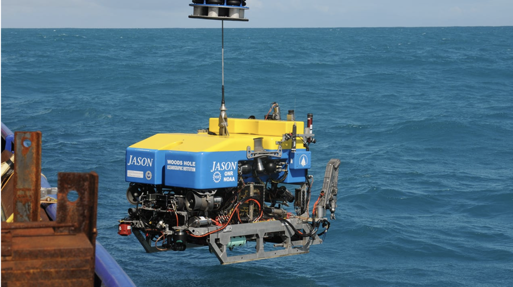
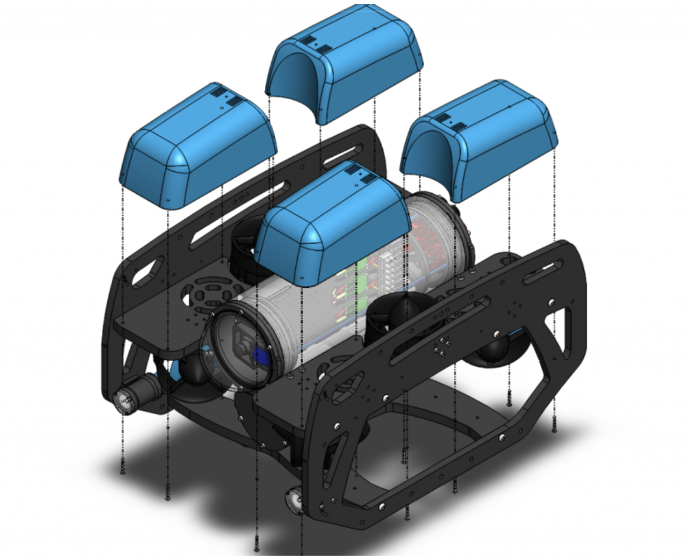
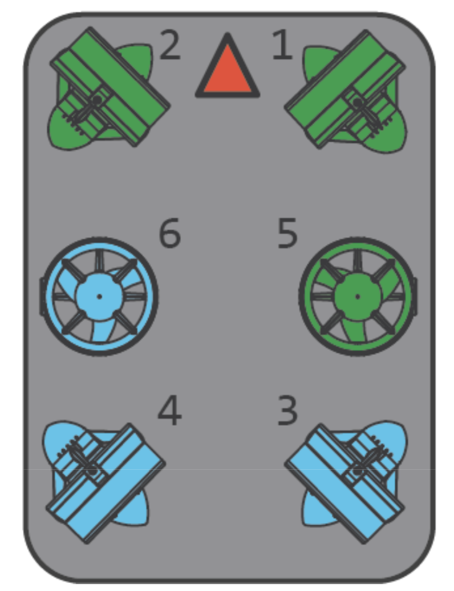
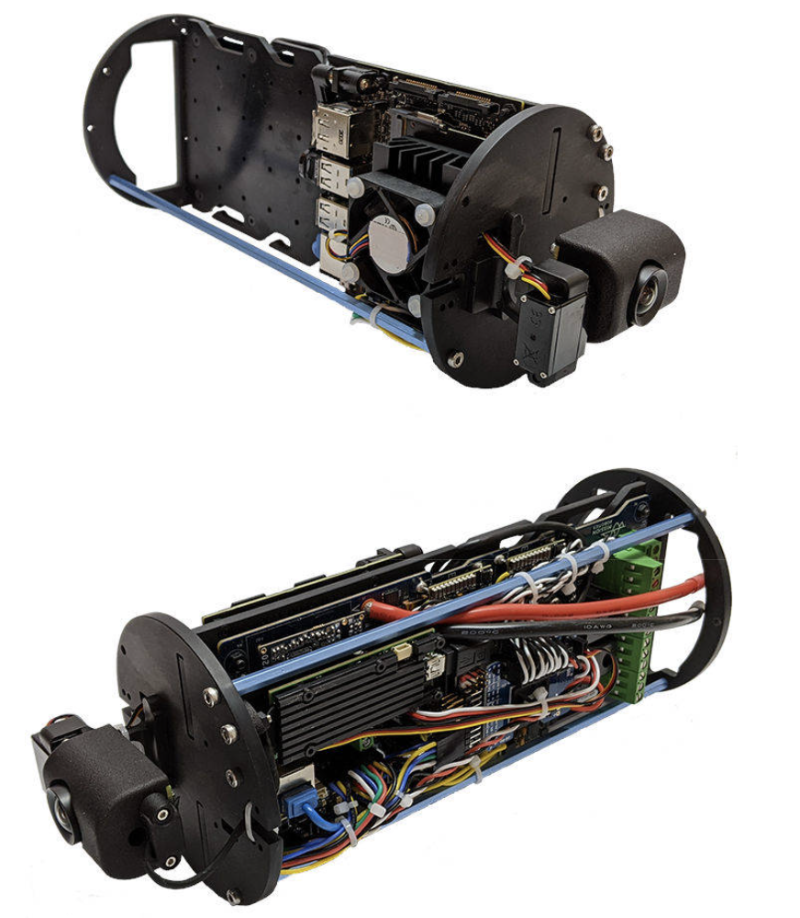
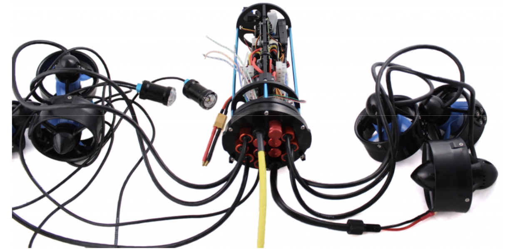
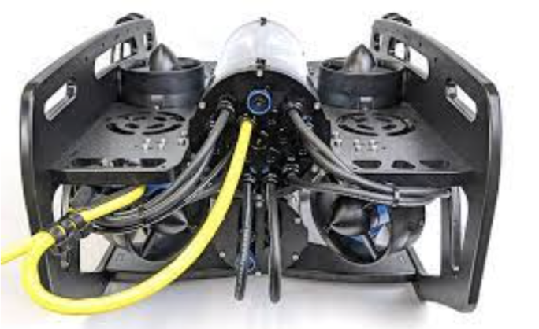
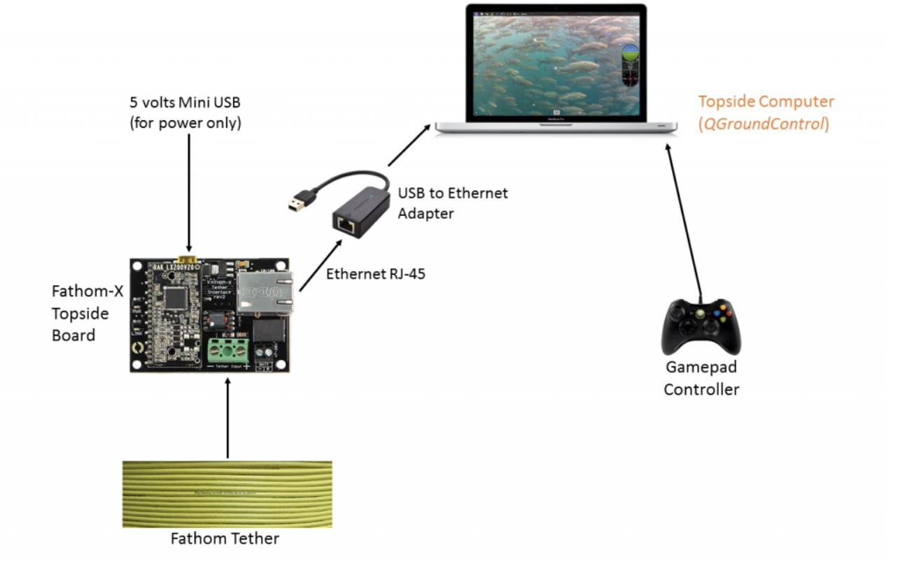

# 1.3 BlueROV2 Platform

## UUVs
Unmanned Underwater Vehicles (UUVs) are vehicles that operate underwater without a human pilot on board.
Remotely operated vehicles (ROV), Autonomous Underwater Vehicles (AUV), and gliders are UUVs and have numerous applications, especially in a water environment, most commonly the ocean.

Autonomous vehicles are preprogrammed with missions, allowing the vehicle to operate independently for hours or days.
They can navigate appropriately using GPS at the surface and internal navigation systems when underwater.
Depending on the type and duration of the mission, the AUVs can surface throughout the mission and send data back to the team via satellite.
Due to the independent nature of these applications, the robots are untethered. Autonomous vehicles can perform a variety of missions, such as:
- Seafloor mapping
- Environmental
- Climate research
- Pipeline and cable surveys
- Military applications
- Archaeology/Oceanographic and exploration missions

*<small> AUV: Slocum glider used by BIOS for Oceanographic monitoring and research, gathering data on physical, chemical, and biological processes.</small>*

ROVs require a tether and a team, especially a pilot at the surface to control the vehicle.
The team is either above the surface on a boat or a platform.
 An advantage of an ROV is the real-time control and live feed.
 These vehicles can also carry manipulators, sonars, and sampling devices, allowing the pilot to directly interact with the undersea environment.
ROVs have many main uses, including:
- Inspection and maintenance
- Search and recovery
- Scientific research
- Construction Support
- Environmental Monitoring

*<small> WHOI ROV Jason: Used for dives to hydrothermal vents and shipwrecks.
This ROV is equipped with sensors, video and still imaging systems, lighting, and numerous sampling systems.
The manipulator arm allows for the collection of rock, sediment, and marine life, which can then be passed to the surface for further examination.</small>*

## BlueROV2
The BlueROV2 is an affordable, remotely (or autonomously) operated vehicle.
These vehicles are primarily used for exploratory missions.

<iframe width="560" height="315" src="https://www.youtube.com/embed/4sSxPkhI9Do?si=QF4ADMSXhr0ydUWM" title="YouTube video player" frameborder="0" allow="accelerometer; autoplay; clipboard-write; encrypted-media; gyroscope; picture-in-picture; web-share" referrerpolicy="strict-origin-when-cross-origin" allowfullscreen></iframe>

### 🔧 **Structure & Design**
- Modular rectangular frame: 2 side panels, bottom panel, 4 center panels
- Mounts for: Enclosures, thrusters, buoyancy foam, and ballast
- Blue fairings with polyurethane foam → provides positive buoyancy
- Ballast weights added to achieve neutral buoyancy

*<small> Floats on the ROV that makes it positively bouyant.</small>*

### ⚙️ **Thruster Configuration**

*<small>Thruster configuration on the ROV.</small>*

*6 Thrusters Total*
- 2 vertical (top) → vertical movement
- 4 vectored (angled at 45°) → precise horizontal control

*6 Degrees of Freedom*
- Independent thruster control for advanced maneuverability

### 🔋 **Power & Control**

Top Enclosure (sealed):
- 1080p live-feed camera
- Raspberry Pi + onboard sensors (attitude, heading)
- FathomX Ethernet interface
- 6 ESCs (Electronic Speed Controllers)
- Inputs/outputs for lights, pressure & temp sensors
- Pressure relief valve & expansion ports

*<small>Electronics compartment of ROV</small>*

*<small>Thrusters connected to the electronics compartment.</small>*

*<small>Back of BlueROV2.</small>*

Bottom Enclosure:
- Contains battery housing

### 💻 **Pilot Interface**
- Tether connects to FathomX Interface

*<small>FathomX and computer set up.</small>*

- USB connects to laptop for real-time control & video.

