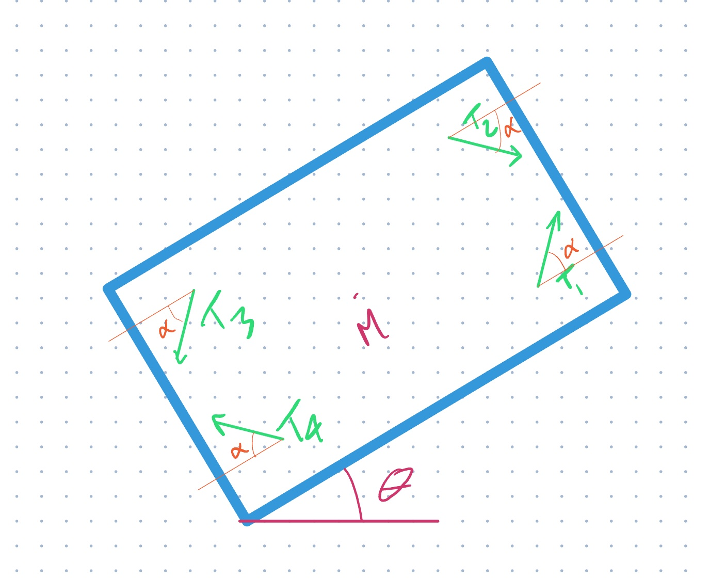

# 1.6 Underwater Physics

## Buoyancy

Archimedes' principle states that the upward buoyant force that is exerted on a body immersed in a fluid, whether fully or partially submerged, is equal to the weight of the fluid that the body displaces.
This principle is essential for understanding the physics of underwater vehicles.

The buoyancy force is given by the following equation:

$$
F_b = \rho \cdot V \cdot g
$$

where $\rho$ is the density of the fluid,
$V$ is the volume of the fluid displaced by the body,
and $g$ is the gravitational acceleration.

## Pressure

The pressure at a given depth $h$ is given by the following equation:

$$
p = \rho \cdot g \cdot h
$$

where $\rho$ is the density of the fluid,
$g$ is the gravitational acceleration,
and $h$ is the depth.

## Equations of Motions (Newton's 2nd Law)

#### Translational Motion

Let's look at Newton's 2nd law of motion:

$$
F = m \cdot a
$$

where $F$ is the force applied to an object,
$m$ is the mass of the object,
and $a$ is the acceleration of the object.

#### Rotational Motion

Newton's 2nd law of motion can also be applied to rotational motion:

$$
\tau = I \times \alpha
$$

where $\tau$ is the torque applied to an object,
$I$ is the moment of inertia of the object,
and $\alpha$ is the angular acceleration of the object.

The torque $\tau$ is given by the following equation:

$$
\tau = r \times F
$$

where $r$ is the distance from the axis of rotation to the point where the force is applied,
and $F$ is the force applied to the object.

The moment of inertia $I$ is given by the following equation:

$$
I = \sum_i m_i \cdot r_i^2
$$

where $m_i$ is the mass of the $i$th particle,
and $r_i$ is the distance from the axis of rotation to the $i$th particle.

:::info
In our case, we will be dealing with a rigid body.
Therefore, we can use the following equation to calculate the moment of inertia:

$$
I = m \cdot r^2
$$

where $m$ is the mass of the object,
and $r$ is the distance from the axis of rotation to the center of mass of the object.
:::

## Problem Set

:::note
Create a new Python file called `physics.py` in your repository for this section.

1. Do not forget to write a docstring for each function.
1. Write a test function for each function.
1. Do not forget to add and commit your changes.
1. Do not forget to push your changes to GitHub.

:::

### Problem 1

- Write a Python function, `calculate_buoyancy`,
  that calculates the buoyancy force exerted on a object submerged in water.
- The function should take the following arguments:
  - `V`: the volume of the object in cubic meters,
  - `density_fluid`: the density of the fluid in $kg/m^3$.
- Use the formula above to calculate the buoyancy force.
  `g` is a constant equal to $9.81 m/s^2$.
- The function should return the buoyancy force in Newtons.

### Problem 2

- Write a Python function, `will_it_float`,
  that determines whether an object will float or sink in water.
- The function should take the following arguments:
  - `V`: the volume of the object in cubic meters,
  - `mass`: the mass of the object in kilograms.
- The function should return `True` if the object will float and `False` if the object will sink.

### Problem 3

- Write a Python function, `calculate_pressure`,
  that calculates the pressure at a given depth in water.
- The function should take the following arguments:
  - `depth`: the depth in meters.
- Use the formula above to calculate the pressure.
  `g` is a constant equal to $9.81 m/s^2$,
  and the density of water is $1000 kg/m^3$.
- The function should return the pressure in Pascals.

### Problem 4

- Write a Python function, `calculate_acceleration`,
  that calculates the acceleration of an object given the force applied to it and its mass.
- The function should take the following arguments:
  - `F`: the force applied to the object in Newtons,
  - `m`: the mass of the object in kilograms.

### Problem 5

- Write a Python function, `calculate_angular_acceleration`,
  that calculates the angular acceleration of an object given the torque applied to it and its moment of inertia.
- The function should take the following arguments:
  - `tau`: the torque applied to the object in Newton-meters,
  - `I`: the moment of inertia of the object in $kg \cdot m^2$.

### Problem 6

- Write a Python function, `calculate_torque`,
  that calculates the torque applied to an object given the force applied to it and the distance from the axis of rotation to the point where the force is applied.
- The function should take the following arguments:
  - `F_magnitude`: the magnitude of force applied to the object in Newtons,
  - `F_direction`: the direction of the force applied to the object in degrees,
  - `r`: the distance from the axis of rotation to the point where the force is applied in meters.

### Problem 7

- Write a Python function, `calculate_moment_of_inertia`,
  that calculates the moment of inertia of an object given its mass and the distance from the axis of rotation to the center of mass of the object.
- The function should take the following arguments:
  - `m`: the mass of the object in kilograms,
  - `r`: the distance from the axis of rotation to the center of mass of the object in meters.

### Problem 8

An AUV is submerged in water.
The AUV has a mass of $100 kg$ and a volume of $0.1 m^3$.
The AUV is equipped with a thruster that can apply a force up to $100 N$.
The thruster is located $0.5 m$ from the center of mass of the AUV.
The thruster is oriented along the $x$-axis.
The thruster can rotate $30^\circ$ in either direction of the $x$-axis.

1. Write a Python function, `calculate_auv_acceleration`,
   that calculates the acceleration of the AUV in the 2D plane.

- The function should take the following arguments:
  - `F_magnitude`: the magnitude of force applied by the thruster in Newtons.
  - `F_angle`: the angle of the force applied by the thruster in radians.
    The angle is measured from the $x$-axis.
    Positive angles are measured in the counter-clockwise direction.
  - `mass` (optional): the mass of the AUV in kilograms.
    The default value is $100 kg$.
  - `volume` (optional): the volume of the AUV in cubic meters.
    The default value is $0.1 m^3$.
  - `thruster_distance` (optional): the distance from the center of mass of the AUV to the thruster in meters.
    The default value is $0.5 m$.
- The function should return the acceleration of the AUV in meters per second squared.

2. Write a Python function, `calculate_auv_angular_acceleration`,
   that calculates the angular acceleration of the AUV.

- The function should take the following arguments:
  - `F_magnitude`: the magnitude of force applied by the thruster in Newtons.
  - `F_angle`: the angle of the force applied by the thruster in radians.
  - `inertia` (optional): the moment of inertia of the AUV in $kg \cdot m^2$.
    The default value is $1 kg \cdot m^2$.
  - `thruster_distance` (optional): the distance from the center of mass of the AUV to the thruster in meters.
    The default value is $0.5 m$.
- The function should return the angular acceleration of the AUV in radians per second squared.

### Problem 9

And AUV is submerged in water.
The AUV has 4 thrusters fixed to the body of the AUV with and angle $\alpha$.
Each thruster applies a force $T_i$ to the AUV, where $i$ is the thruster number.
The thrusters are offset from the center of mass of the AUV by a distance $L$ longitudinally and $l$ laterally, in the robot frame.

1. Write a Python function, `calculate_auv2_acceleration`,
   that calculates the acceleration of the AUV in the 2D plane.

- The function should take the following arguments:
  - `T`: an `np.ndarray` of the magnitudes of the forces applied by the thrusters in Newtons.
  - `alpha`: the angle of the thrusters in radians.
  - `theta`: the angle of the AUV in radians.
  - `mass` (optional): the mass of the AUV in kilograms.
    The default value is $100 kg$.

2. Write a Python function, `calculate_auv2_angular_acceleration`,
   that calculates the angular acceleration of the AUV.

- The function should take the following arguments:
  - `T`: an `np.ndarray` of the magnitudes of the forces applied by the thrusters in Newtons.
  - `alpha`: the angle of the thrusters in radians.
  - `L`: the distance from the center of mass of the AUV to the thrusters in meters.
  - `l`: the distance from the center of mass of the AUV to the thrusters in meters.
  - `inertia` (optional): the moment of inertia of the AUV in $kg \cdot m^2$.
    The default value is $100 kg \cdot m^2$.

### Problem 10

Using the functions you wrote in Problem 9,
simulate the motion of the AUV in the 2D plane.

- The AUV should start at the origin with an initial velocity of $0 m/s$.
- The AUV should be able to move in any direction.
- The AUV should be able to rotate in either direction.
- The AUV should be able to move and rotate simultaneously.

1. Write a Python function, `simulate_auv2_motion`,
   that simulates the motion of the AUV in the 2D plane.

- The function should take the following arguments:
  - `T`: an `np.ndarray` of the magnitudes of the forces applied by the thrusters in Newtons.
  - `alpha`: the angle of the thrusters in radians.
  - `L`: the distance from the center of mass of the AUV to the thrusters in meters.
  - `l`: the distance from the center of mass of the AUV to the thrusters in meters.
  - `mass` (optional): the mass of the AUV in kilograms.
    The default value is $100 kg$.
  - `inertia` (optional): the moment of inertia of the AUV in $kg \cdot m^2$.
    The default value is $100 kg \cdot m^2$.
  - `dt` (optional): the time step of the simulation in seconds.
    The default value is $0.1 s$.
  - `t_final` (optional): the final time of the simulation in seconds.
    The default value is $10 s$.
  - `x0` (optional): the initial $x$-position of the AUV in meters.
    The default value is $0 m$.
  - `y0` (optional): the initial $y$-position of the AUV in meters.
    The default value is $0 m$.
  - `theta0` (optional): the initial angle of the AUV in radians.
    The default value is $0 rad$.
- The function should return the following:
  - `t`: an `np.ndarray` of the time steps of the simulation in seconds.
  - `x`: an `np.ndarray` of the $x$-positions of the AUV in meters.
  - `y`: an `np.ndarray` of the $y$-positions of the AUV in meters.
  - `theta`: an `np.ndarray` of the angles of the AUV in radians.
  - `v`: an `np.ndarray` of the velocities of the AUV in meters per second.
  - `omega`: an `np.ndarray` of the angular velocities of the AUV in radians per second.
  - `a`: an `np.ndarray` of the accelerations of the AUV in meters per second squared.

2. Write a Python function, `plot_auv2_motion`,
   that plots the motion of the AUV in the 2D plane.
   No need to test this function.
   You can try it out in the Jupyter Notebook.

- The function should take the following arguments:
  - `t`: an `np.ndarray` of the time steps of the simulation in seconds.
  - `x`: an `np.ndarray` of the $x$-positions of the AUV in meters.
  - `y`: an `np.ndarray` of the $y$-positions of the AUV in meters.
  - `theta`: an `np.ndarray` of the angles of the AUV in radians.
  - `v`: an `np.ndarray` of the velocities of the AUV in meters per second.
  - `omega`: an `np.ndarray` of the angular velocities of the AUV in radians per second.
  - `a`: an `np.ndarray` of the accelerations of the AUV in meters per second squared.
