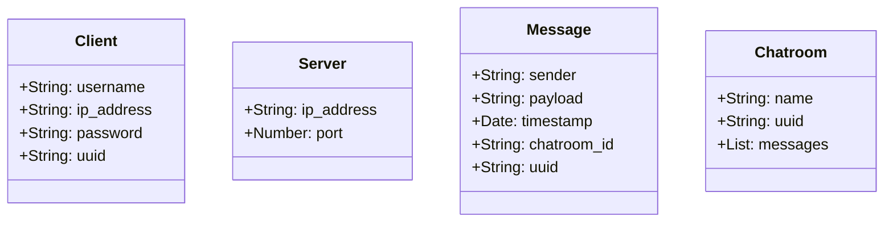
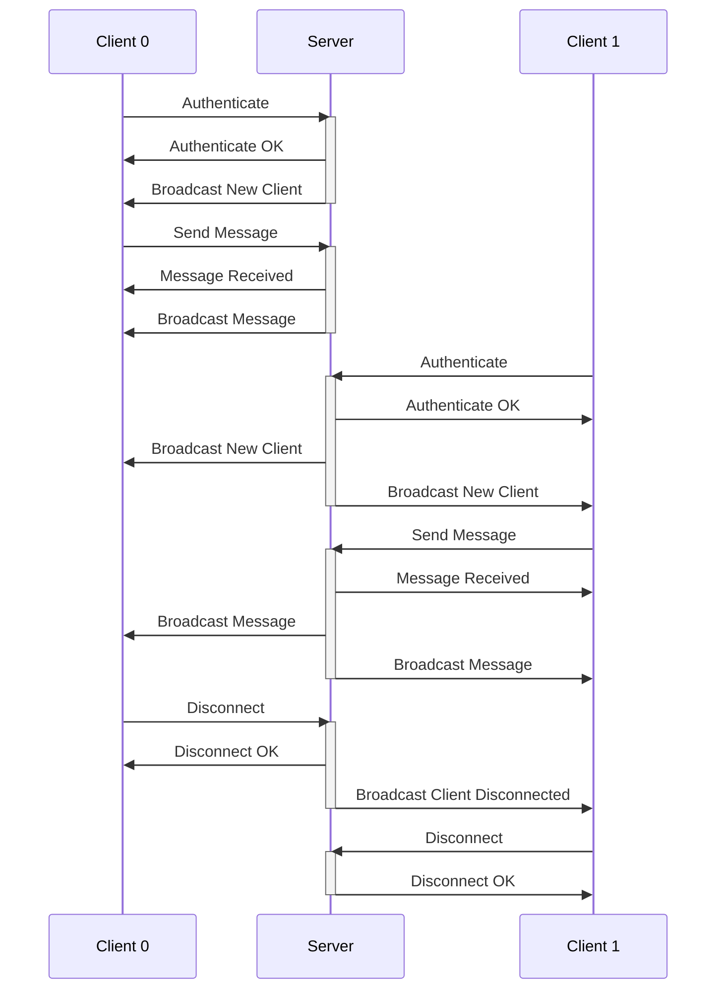

# 1.7 Networking

<iframe
  src="https://blksail-edu.github.io/slides/networking/"
  width="100%"
  height={320}
  frameborder="0"
  allowfullscreen
></iframe>

## OSI Model

## DNS

### mDNS

## Ethernet

## MAC Address

## IP Address

## Ports

## Sockets

## Packets

## Practice Problems

### Problem 1: Chat Application

In Python, implement a chat application (server and client) that allows users to send messages in a common chat room.

:::note

Fork the [chat application](https://github.com/blksail-edu/simple-chat-app) repository and clone it to your local machine.

You will be working in a team setup, so make sure to coordinate with your team members.
One fork per team.
Each team member should be working on a separate branch.

:::

#### Requirements

- The server should be able to handle multiple clients at once.
- The server should broadcast messages to all clients.
- The server should send a message to the chatroom when a new client joins the chat room.
- The server should send a message to the chatroom when a client leaves the chat room.
- The client should be able to send messages to the server.
- The client should be able to receive messages from the server.
- The client should be able to gracefully exit the chat room.
- The client should have a username, which is sent to the server when the client joins the chat room.
- The server should keep track of all clients in the chat room.
- The client is defined by:

  - username
  - IP address
  - password
  - unique ID

- The server is defined by:

  - IP address
  - port

- A message in the chat room is defined by:

  - sender (the client ID)
  - payload (the message)
  - timestamp
  - chatroom ID
  - unique ID

- The chat room is defined by:

  - name
  - unique ID

#### Hints

Here's a class diagram to help you get started:

You should at least have the following files:

- `chat_server.py`
  This is the main file that runs the server.
- `chat_client.py`
  This is the main file that runs the client.
- `client.py`
  This is the client class.
- `server.py`
  This is the server class.
- `message.py`
  This is the message class.
- `chatroom.py`
  This is the chatroom class.

Here's a sequence diagram to help you get started:

