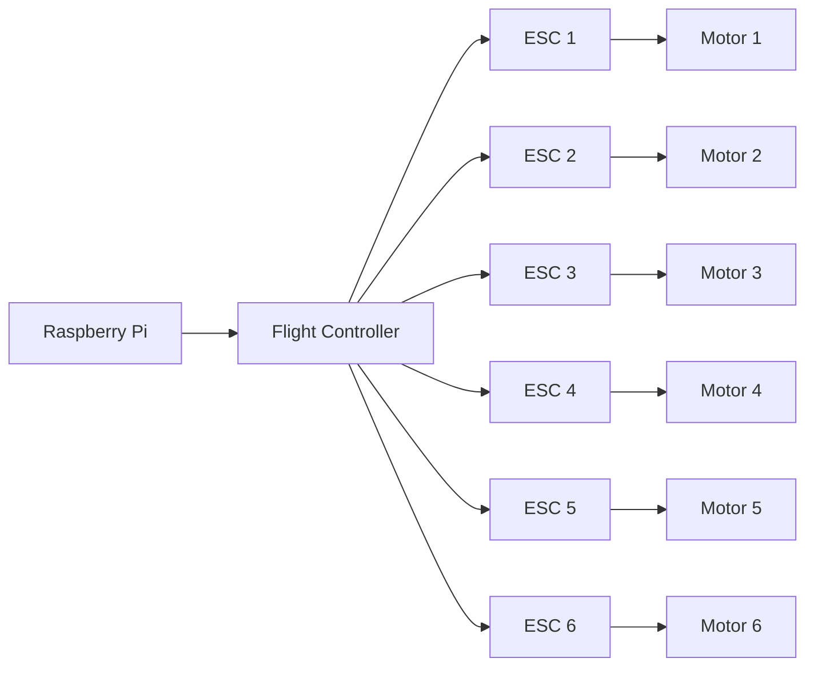

# Motor Control

## Introduction

The motors used in the robot are brushless DC motors.
These motors are controlled by a Electronic Speed Controller (ESC).
The ESCs are controlled by the flight controller, which in turn is controlled by the Raspberry Pi.



## ESCs

The ESCs receive a Pulse Width Modulation (PWM) signal from the flight controller.
This is a signal that is sent at a fixed frequency, but the duty cycle of the signal is varied.
The duty cycle is the percentage of the time that the signal is high.
The ESCs use this signal to determine the speed of the motor.
This is common is RC applications, and is the same way that servos are controlled, see [Servo Control - Wikipedia](https://en.wikipedia.org/wiki/Servo_control)


The ESCs are connected to the flight controller using a 3 pin connector.
The pins are labelled as follows:

- `GND` - Ground
- `5V` - 5V power supply
- `S` - Signal

## Motors

The motors are brushless DC motors.
A brushless DC motor is a synchronous electric motor which is powered by direct-current electricity (DC) and which has an electronically controlled commutation system, instead of a mechanical commutation system based on brushes.
In such motors, current and torque, voltage and rpm are linearly related.


We can control the speed of the motor by varying the voltage applied to the motor.
The ESCs do this for us, and we can control the speed of the motor by varying the duty cycle of the PWM signal.

## Flight Controller

The flight controller is a device that is used to control the motors.
It is a microcontroller that is designed to be used in drones.
It has a number of sensors that are used to determine the orientation of the drone.
It then uses this information to control the motors.

The BlueROV2 uses a Pixhawk flight controller.

The flight controller is connected to the Raspberry Pi using a serial connection.
The Raspberry Pi sends commands to the flight controller, and the flight controller sends back information about the sensors.
It uses the [MAVLink](https://mavlink.io/en/) protocol to communicate with the Raspberry Pi.

:::note

In this section, we will use the flight controller to control the motors.
We will be ignoring the sensors on the flight controller, and will be using the Raspberry Pi to control the flight controller.

:::

## Raspberry Pi (Onboard Computer)

The Raspberry Pi inside the BlueROV2 is used to control the flight controller.
(We will call this the onboard Raspberry Pi.)
It is running a program called [ArduSub](https://www.ardusub.com/) alongside a set of other programs as [BlueOS](https://docs.bluerobotics.com/ardusub-zola/software/onboard/BlueOS-1.1/)
ArduSub is a program that is designed to control underwater vehicles.
It is based on the [ArduPilot](https://ardupilot.org/) project, which is a program that is designed to control aerial vehicles.

From your RPi (the autonomy computer moving forward), you can control the motors by sending commands to the flight controller.
You can do this by sending MAVLink commands to the flight controller.
We will be using the python library [pymavlink](https://www.ardusub.com/developers/pymavlink.html) to do this.

## Controlling the Motors from the autonomy computer

### Setting up the autonomy computer

#### Fixing the IP address

The onboard computer has a static IP address of `192.168.2.2`.
This means that the IP address will not change.
It is expecting that any computer it will be communicating with will have an IP address of `192.168.2.1`.

The autonomy computer is currently set up to use [DHCP](https://en.wikipedia.org/wiki/Dynamic_Host_Configuration_Protocol) to get an IP address.
This means that the IP address of the autonomy computer will change every time it is restarted.
We need to change this so that the IP address of the autonomy computer is always `192.168.2.1`.
To do this, we need to edit the file `/etc/dhcpcd.conf`.

First, let's find the network interface that connects to the onboard computer.
With the inteface disconnected, run the following command:

```bash
ip addr
```

This will show you a list of all the network interfaces on the computer.
Now connect the interface to the onboard computer, and run the command again.
You should see a new interface appear.
Take note of the name of this interface.

Now we can edit the `/etc/dhcpcd.conf` file.
You can do this by running the following command:

```bash
sudo nano /etc/dhcpcd.conf
```

This will open the file in the [`nano`](https://en.wikipedia.org/wiki/GNU_nano) text editor.
You can then add the following lines to the end of the file:

```bash
interface <INTERFACE_NAME>
static ip_address=192.168.2.1/24
```

Where `<INTERFACE_NAME>` is the name of the interface that you found earlier.

Now save the file by pressing `Ctrl + X`, then `Y`, then `Enter`.

Once you have done this, you can restart the `dhcpd` service by running the following command:

```bash
sudo systemctl restart dhcpcd
```

Now, if you run the `ip addr` command again, you should see that the IP address of the interface is `192.168.2.1`.
You should also be able to ping the onboard computer by running the following command:

```bash
ping 192.168.2.2
```

#### Testing the connection

Now that we have set up the IP address, we can test the connection to the onboard computer.

Go ahead and fork the following repository: [Simple Web Control](https://github.com/blksail-edu/simple-web-control)

Then clone the repository onto the autonomy computer.
You can do this by running the following command:

```bash
git clone <YOUR_FORK_URL>
```

Then create a virtualenv, and install the dependencies by running the following command:

```bash
mkvirtualenv simple-web-control
cd simple-web-control
pip install -r requirements.txt
```

Now you can run the program by running the following command:

```bash
python sliders.py
```
