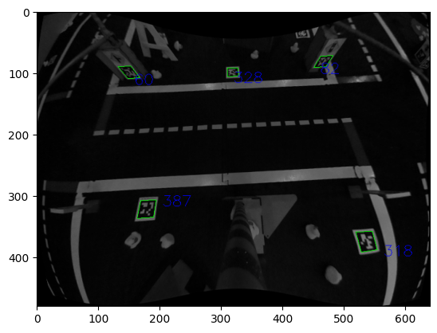

# 3.2 Image Recognition

The BlueROV2 is equipped with a forward-facing camera on a gimbal.
We will be using this camera to detect objects in the water.

## OpenCV

[OpenCV](https://opencv.org/) is a library of programming functions mainly aimed at real-time computer vision.
It is open-source and free for commercial use.
It is written in C++ and has bindings for Python.

### Installation

On the backseat computer, we will be using [OpenCV with Python](https://github.com/opencv/opencv-python).

Create a new virtual environment and install OpenCV:

```bash
mkvirtualenv -p python3 bluecv
workon bluecv
pip install opencv-python-headless
```

Now, fork [cv-intro](https://github.com/blksail-edu/cv-intro) and clone it in the home directory.
Open the `cv-intro` folder in VSCode.

Create a new Jupyter notebook:

```bash
touch test.ipynb
```

Open the file in VSCode and add the following code:

```python
import cv2
import numpy as np
import matplotlib.pyplot as plt
```

Run the code and make sure it works.

:::note

If you get an error, make sure:

1. You are in the `bluecv` virtual environment.
   VSCode should display the name of the virtual environment in top right corner of the Jupyter notebook.
2. You installed all the dependencies.
   Try installing them with `pip install [...]`.
   This should be run in the virtual environment.

:::

### Reading Images

To read an image, use the `imread` function:

```python
img = cv2.imread('image.jpg')
```

The image is stored as a NumPy array.
To display the image, use the `imshow` function:

```python
plt.imshow(img)
```

### Reading Videos

To read a video, use the `VideoCapture` function:

```python
cap = cv2.VideoCapture('video.mp4')
```

To read the video frame by frame, use the `read` function:

```python
ret, frame = cap.read()
```

### Drawing on Images

To draw a line on an image, use the `line` function:

```python
cv2.line(img, (0, 0), (100, 100), (255, 0, 0), 5)
```

To draw a rectangle on an image, use the `rectangle` function:

```python
cv2.rectangle(img, (0, 0), (100, 100), (0, 255, 0), 5)
```

To draw a circle on an image, use the `circle` function:

```python
cv2.circle(img, (50, 50), 50, (0, 0, 255), 5)
```

To draw a polygon on an image, use the `polylines` function:

```python
pts = np.array([[10, 5], [20, 30], [70, 20], [50, 10]], np.int32)
pts = pts.reshape((-1, 1, 2))
cv2.polylines(img, [pts], True, (0, 255, 255), 5)
```

To draw text on an image, use the `putText` function:

```python
cv2.putText(img, 'Hello World!', (0, 130), cv2.FONT_HERSHEY_SIMPLEX, 1, (255, 255, 255), 2, cv2.LINE_AA)
```

:::tip

Visualize the image using `plt.imshow(img)` after each drawing operation to see the result.

:::

## Line Detection

### Hough Transform

The [Hough transform](https://en.wikipedia.org/wiki/Hough_transform) is a feature extraction technique used in image analysis, computer vision, and digital image processing.
The purpose of the technique is to find imperfect instances of objects within a certain class of shapes by a voting procedure.

### Probabilistic Hough Transform

The [probabilistic Hough transform](https://docs.opencv.org/3.4/d9/db0/tutorial_hough_lines.html) is an optimization of the Hough transform.
It is a straight line detection method.
It returns the start and end points of the detected lines.

### Example

```python
gray = cv2.cvtColor(img, cv2.COLOR_BGR2GRAY) # convert to grayscale
edges = cv2.Canny(gray, 50, 150, apertureSize=3) # detect edges
lines = cv2.HoughLinesP(
                edges,
                1,
                np.pi/180,
                100,
                minLineLength=100,
                maxLineGap=10,
        ) # detect lines

for line in lines:
    x1, y1, x2, y2 = line[0]
    cv2.line(img, (x1, y1), (x2, y2), (0, 255, 0), 2)

plt.imshow(img)
```

:::warning Check-Off

- [ ] Run the code above and make sure it works.
- [ ] What do the parameters of the `HoughLinesP` function do?
- [ ] What happens if you change the parameters?
- [ ] What happens if you change the `minLineLength` and `maxLineGap` parameters?
- [ ] What happens if you change the `apertureSize` parameter of the `Canny` function?
- [ ] What happens if you change the `threshold1` and `threshold2` parameters of the `Canny` function?
- [ ] Modify the code to detect pool lanes.

:::

## April Tags

[AprilTags](https://april.eecs.umich.edu/software/apriltag.html) are a type of fiducial marker.
They are designed to be easily detected by computer vision algorithms.
They are used in robotics for localization and navigation.

### Installation

On the backseat computer, we will be using [Python bindings for the Apriltags 3 library by Duckietown](
](https://github.com/duckietown/lib-dt-apriltags)

In the same virtual environment as before, install the library:

```bash
pip install dt-apriltags
```

### Example


Download the image above and save it as `test_image.png`.
In a terminal, run the following command:

```bash
wget https://blksail-edu.github.io/img/test_image.png
```

Back in the Jupyter notebook, add the following code:

```python
from dt_apriltags import Detector
```

```python
img = cv2.imread('test_image.png', cv2.IMREAD_GRAYSCALE)
```

```python
at_detector = Detector(families='tag36h11',
                       nthreads=1,
                       quad_decimate=1.0,
                       quad_sigma=0.0,
                       refine_edges=1,
                       decode_sharpening=0.25,
                       debug=0)
```

```python
tags = at_detector.detect(img, estimate_tag_pose=False, camera_params=None, tag_size=None)
```

```python
color_img = cv2.cvtColor(img, cv2.COLOR_GRAY2RGB)
```

```python
for tag in tags:
    for idx in range(len(tag.corners)):
        cv2.line(color_img, tuple(tag.corners[idx - 1, :].astype(int)), tuple(tag.corners[idx, :].astype(int)), (0, 255, 0))

    cv2.putText(color_img, str(tag.tag_id),
                org=(tag.corners[0, 0].astype(int) + 10, tag.corners[0, 1].astype(int) + 10),
                fontFace=cv2.FONT_HERSHEY_SIMPLEX,
                fontScale=0.8,
                color=(0, 0, 255))
```

```python
plt.imshow(img)
```

The result should look like this:



:::warning Check-Off

- [ ] Run the code above and make sure it works.
- [ ] What do the parameters of the `Detector` function do?
- [ ] What happens if you change the parameters?
- [ ] What are `families`?
- [ ] What does `estimate_tag_pose` do?
- [ ] What does `camera_params` do?
- [ ] What does `tag_size` do?
- [ ] The `detect` function returns a list of tags.
      What information does each tag contain?
- [ ] Modify the code to give the position and orientation of each tag.

:::

## Problem set

### Problem 1: Lane Detection

In a new file `lane_detection.py`:

1. Write a python function `detect_lines` that takes an image as an input and returns a list of detected lines.
   The function should take the following parameters:
   - `img`: the image to process
   - `threshold1`: the first threshold for the Canny edge detector (default: 50)
   - `threshold2`: the second threshold for the Canny edge detector (default: 150)
   - `apertureSize`: the aperture size for the Sobel operator (default: 3)
   - `minLineLength`: the minimum length of a line (default: 100)
   - `maxLineGap`: the maximum gap between two points to be considered in the same line (default: 10)
2. Write a python function `draw_lines` that takes an image and a list of lines as inputs and returns an image with the lines drawn on it.
   The function should take the following parameters:
   - `img`: the image to process
   - `lines`: the list of lines to draw
   - `color`: the color of the lines (default: (0, 255, 0))
3. Write a python function `get_slopes_intercepts` that takes a list of lines as an input and returns a list of slopes and a list of intercepts.
   The function should take the following parameters:

   - `lines`: the list of lines to process

   The function should return the following parameters:

   - `slopes`: the list of slopes
   - `intercepts`: the list of horizontal intercepts

4. Write a python function `detect_lanes` that takes a list of lines as an input and returns a list of lanes.
   The function should take the following parameters:

   - `lines`: the list of lines to process

   The function should return the following parameters:

   - `lanes`: the list of lanes

   The function should do the following:

   1. Get the slopes and intercepts of the lines using the `get_slopes_intercepts` function.
   2. Check if a pair of lines is a lane.
   3. Return the list of lanes. Each lane should be a list of two lines.

5. Write a python function `draw_lanes` that takes an image and a list of lanes as inputs and returns an image with the lanes drawn on it. Each lane should be a different color.
   The function should take the following parameters:
   - `img`: the image to process
   - `lanes`: the list of lanes to draw

Test your code with the following image:


:::note

Create a new Jupyter notebook `lane_detection.ipynb` and test your code.

:::

### Problem 2: Lane Following

In a new file `lane_following.py`:

1. Write a python function `get_lane_center` that takes a list of lanes as an input and returns the intercept and slope of the closest lane.
   The function should take the following parameters:

   - `lanes`: the list of lanes to process

   The function should return the following parameters:

   - `center_intercept`: the horizontal intercept of the center of the closest lane
   - `center_slope`: the slope of the closest lane

   The function should use the functions written in the previous problem set.

2. Write a python function `recommend_direction` that takes the center of the closest lane and its slope as inputs and returns a direction.
   The function should take the following parameters:

   - `center`: the center of the closest lane
   - `slope`: the slope of the closest lane

   The function should return the following parameters:

   - `direction`: the recommended direction

   The function should do the following:

   1. If the center is on the left of the image, return `left`.
   2. If the center is on the right of the image, return `right`.
   3. If the center is in the middle of the image, return `forward`.


